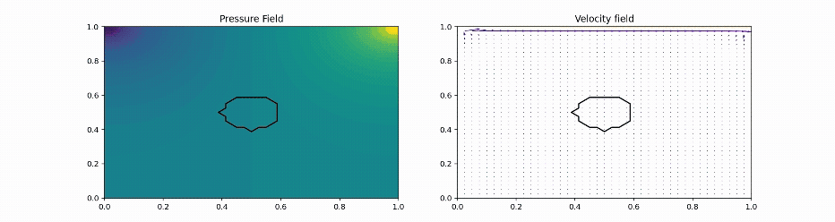

# Fluid Simulation Project

Numerical fluid simulation exploring the behaviour of incompressible flow.

This project implements a simplified solver inspired by the Navier–Stokes equations and visualises the resulting flow field.

---

## Simulation Animation
Lid driven fluid flow animation

---

## Project Overview

This project explores computational fluid dynamics through a grid-based simulation.

Key features:

- 2D velocity field simulation
- diffusion and advection steps
- pressure projection to enforce incompressibility
- visualisation of fluid motion
- fluid motion around objects

---

## What the Simulation Demonstrates

- vortex formation
- fluid diffusion
- velocity field evolution over time
- fluid flow around objects

---

## Code

The source code for the simulation is available in this repository.

---

